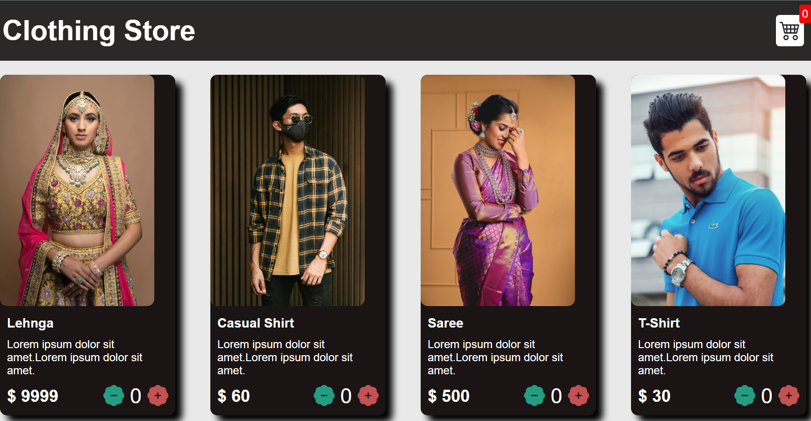

# ShoppingCart
Shopping Cart is a user-friendly website that allows shoppers to easily browse, add products to their cart, and adjust item quantities. With a seamless user interface and intuitive controls, customers can effortlessly explore a wide range of products and manage their shopping experience efficiently.

# Shopping Cart Website

Welcome to our Clothing Store Website! This web application allows users to browse through a selection of clothing items and add them to their cart for purchase.

## Features

- View a wide range of clothing items on the homepage.
- Add items to the cart with the help of increment and decrement buttons for easy selection.
- Navigate to the cart page to review the selected items, their quantities, total prices, and product images.
- Modify the quantities of items in the cart or remove items as needed.
- Proceed to checkout and make a purchase securely.

## Usage

- On the homepage, browse through the collection of clothing items.
- Use the increment and decrement buttons in the cart to adjust the quantity of items.
- Click on the "Cart" iconk in the navigation bar to view the selected items and their details.
- To remove an item from the cart, click the "Remove" button next to the item.
- Proceed to the checkout page to complete your purchase.

## Technologies Used

- HTML, CSS, and JavaScript 

## Contributing

We welcome contributions to improve the website or fix any issues. If you would like to contribute, please follow these steps:

1. Fork the repository.
2. Create a new branch for your feature or bug fix.
3. Make changes and commit them.
4. Push the changes to your forked repository.
5. Submit a pull request to the main repository.
